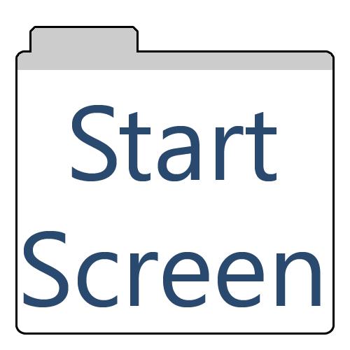

# Start Screen

Start Screen provides a rich start screen experiance for all users and a
platform to access other resources.

Start Screen is designed to be run behind Azure Application Proxy using header
authentication, where the current users upn is passed through the header
`azure-upn`. Ideally there will be SSO in school so that users will just
seamlessly connect.

## Features

- Google Search
- Shortcuts based on users lessons, type, year group, local/remote.
- Doodles!
- Adverts
- Printer Consumable Levels
- Student Password Resets

## Getting Started

The easiest way to run Connect.LHS is to use docker. Grab a copy of
[docker-compose.yml](./docker-compose.sample.yaml) and change the Postgres
Password and data paths. Then launch with `docker-compose up -d`.

Connect.LHS defaults to port 3000

Setup Azure Application Proxy to send requests and use Header Based Auth to set
the header `azure-upn` to the users upn.

Browse to `https://your.app.address/setup` and run through the setup there.

Once setup is complete you will be redirected to the admin panel.

From here you have access to all the admin options.

## License

Default Background photo by
[Ivan Aleksic](https://unsplash.com/@ivalex?utm_source=unsplash&utm_medium=referral&utm_content=creditCopyText)
on
[Unsplash](https://unsplash.com/photos/PDRFeeDniCk?utm_source=unsplash&utm_medium=referral&utm_content=creditCopyText)
