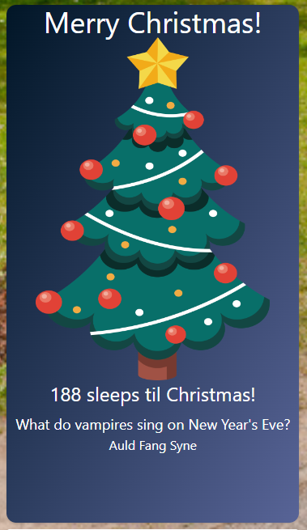

# Working with MDX

[MDX](https://mdxjs.com/) merges
[Markdown](https://en.wikipedia.org/wiki/Markdown) with
[React](https://react.dev/) (at least in the case of Start Screen) allowing you
to create dynamic components for the Start Screen that are saved into the
database.

Within Start Screen it is used for [Pages](/features/pages) and
[Doodles](/features/doodles) as well as a couple of other places.

In the background Start Screen is using
[mdx-bundler](https://github.com/kentcdodds/mdx-bundler) which in-turn uses
[esbuild](https://esbuild.github.io/) to bundle the mdx code into self-contained
chunks of code.

## A Full Component

To build a fully dynamic component it needs to be exported and then rendered on
the page, in its simpliest form

```mdx
export const MyDoodle = () => {
  return <div>Doodle Content</div>
}

<MyDoodle />
```

From here you can build a normal React Component

## Imports

As Start Screen has access to esbuild you can use standard JavaScript imports
and it will bundle them into the code.

To avoid bloating the bundles some imports are provided from the app.

| Import                                             | Provides                                                         |
| :------------------------------------------------- | :--------------------------------------------------------------- |
| `import motion from 'framer-motion/motion'`        | `motion` from [Framer Motion](https://www.framer.com/motion/).   |
| `import useHydrated from 'lib-hooks-use-hydrated'` | The `useHydrated` React hook which returns `true` on the client. |

## Merry Christmas

A Great example of how MDX can be used is the Christmas 2022 Doodle from
Longridge High.



As per the [Full Component](#a-full-component) example, we start with an empty
div.

```mdx
export const Christmas22 = () => {
  return (
    <div
      className="rounded-xl text-center shadow h-full"
      style={{
        backgroundImage: 'linear-gradient(to bottom right, #011627, #586497)'
      }}
    >
      Merry Christmas
    </div>
  )
}

<Christmas22 />
```

> Notice the mix of [Tailwind](#tailwind) classes and in-line styles. The
> gradient class isn't used anywhere in Start Screen so must be manually set on
> the element.

This produces a full-size box with a background gradient, rounded corners and a
shadow that contains _Merry Christmas_.

From here lets expand it to the full component with no dynamic elements.

```mdx
import motion from 'framer-motion/motion'

export const Christmas22 = () => {
  return (
    <div
      className="rounded-xl text-center shadow h-full"
      style={{
        backgroundImage: 'linear-gradient(to bottom right, #011627, #586497)'
      }}
    >
      <h1 className="text-white text-4xl">Merry Christmas!</h1>
      
      <h2 className="text-white text-2xl mb-2">X sleeps til Christmas!</h2>
      <div>
        <p className="text-lg text-white">JOKE</p>
        <motion.p
          initial={{opacity: 0}}
          animate={{
            opacity: 1,
            transition: {type: 'spring', mass: 1, delay: 3}
          }}
          className="text-white mb-2"
        >
          ANSWER
        </motion.p>
      </div>
    </div>
  )
}

<Christmas22 />
```

From here it can now get its dynamic elements.

For the countdown we need the current time, and then the distance to Christmas.

```js
const christmas = new Date(new Date().getFullYear(), 11, 25) // Don't ask me why months count from 0 but days don't.
const now = new Date()

const days = Math.ceil(
  (christmas.getTime() - now.getTime()) / (1000 * 3600 * 24)
)
```

It's now a simple matter to replace `X` with `{days}`

```mdx
<h2 className="text-white text-2xl mb-2">{days} sleeps til Christmas!</h2>
```

For the jokes we want an array of arrays that are `[joke, answer]`, then to pick
a random entry from that list.

```js
// Add this import at the top
import {randomEntry} from '@arcath/utils'

const JOKES = [
  ['What do angry mice send to each other at Christmas?', 'Cross Mouse Cards'],
  [
    "What do they sing at a snowman's birthday party?",
    'Freeze a jolly good fellow'
  ],
  ['Why does Santa have three gardens?', "So he can 'ho ho ho'"],
  ['What does Miley Cyrus have at Christmas?', 'Twerky'],
  ["What do vampires sing on New Year's Eve?", 'Auld Fang Syne'],
  ["Why did Santa's helper see the doctor?", 'Because he had low elf esteem'],
  ['What happened to the man who stole an Advent Calendar?', 'He got 25 days'],
  ['What kind of motorbike does Santa ride?', 'A Holly Davidson'],
  ['What do you get if you cross Santa with a duck?', 'A Christmas quacker'],
  [
    'What is the best Christmas present in the world?',
    "A broken drum... you just can't beat it"
  ],
  ['How did Scrooge win the football game?', 'The ghost of Christmas passed'],
  ['Who delivers presents to baby sharks at Christmas?', 'Santa Jaws'],
  ["Who is Santa's favorite singer?", 'Elf-is Presley'],
  ["What do Santa's little helpers learn at school?", 'The elf-abet'],
  [
    'What did Santa say to the smoker?',
    "Please don't smoke, it's bad for my elf"
  ],
  ['What do you get if you eat Christmas decorations?', 'Tinselitis!'],
  ['What do you get when you cross a snowman with a vampire?', 'Frostbite.']
]

const [joke, answer] = randomEntry(JOKES)
```

With the joke it's not as simple as just putting `{joke}` and `{answer}` into
the page. As described in [Hydration Issues](#hydration-issues) the client and
server would pick a different joke and mis-match the HTML that gets rendered. A
user would see one joke for a split second that then gets replaced with another.

The solution is to use `useHydrated` and only render the joke on the client.

```mdx
const hydrated = useHydrated()

{hydrated ? (

{' '}

<div>
  <p className="text-lg text-white">{joke}</p>
  <motion.p
    initial={{opacity: 0}}
    animate={{
      opacity: 1,
      transition: {type: 'spring', mass: 1, delay: 3}
    }}
    className="text-white mb-2"
  >
    {answer}
  </motion.p>
</div>
) : ( '' )}
```

Putting it all together gives us this:

```mdx
import {randomEntry} from '@arcath/utils'
import motion from 'framer-motion/motion'

import useHydrated from 'lib-hooks-use-hydrated'

export const Christmas22 = () => {
const JOKES = [
  ['What do angry mice send to each other at Christmas?', 'Cross Mouse Cards'],
  [
    "What do they sing at a snowman's birthday party?",
    'Freeze a jolly good fellow'
  ],
  ['Why does Santa have three gardens?', "So he can 'ho ho ho'"],
  ['What does Miley Cyrus have at Christmas?', 'Twerky'],
  ["What do vampires sing on New Year's Eve?", 'Auld Fang Syne'],
  ["Why did Santa's helper see the doctor?", 'Because he had low elf esteem'],
  ['What happened to the man who stole an Advent Calendar?', 'He got 25 days'],
  ['What kind of motorbike does Santa ride?', 'A Holly Davidson'],
  ['What do you get if you cross Santa with a duck?', 'A Christmas quacker'],
  [
    'What is the best Christmas present in the world?',
    "A broken drum... you just can't beat it"
  ],
  ['How did Scrooge win the football game?', 'The ghost of Christmas passed'],
  ['Who delivers presents to baby sharks at Christmas?', 'Santa Jaws'],
  ["Who is Santa's favorite singer?", 'Elf-is Presley'],
  ["What do Santa's little helpers learn at school?", 'The elf-abet'],
  [
    'What did Santa say to the smoker?',
    "Please don't smoke, it's bad for my elf"
  ],
  ['What do you get if you eat Christmas decorations?', 'Tinselitis!'],
  ['What do you get when you cross a snowman with a vampire?', 'Frostbite.']
]

const christmas = new Date(new Date().getFullYear(), 11, 25) const now = new
Date()

const days = Math.ceil( (christmas.getTime() - now.getTime()) / (1000 _ 3600
_ 24) )

const [joke, answer] = randomEntry(JOKES) const hydrated = useHydrated()

return <div className="rounded-xl text-center shadow h-full" style={{
  backgroundImage: 'linear-gradient(to bottom right, #011627, #586497)'
}}><h1 className="text-white text-4xl">Merry Christmas!</h1> 

<h2 className="text-white text-2xl mb-2">{days} sleeps til Christmas!</h2>
{hydrated ? (
        <div>
          <p className="text-lg text-white">{joke}</p>
          <motion.p
            initial={{opacity: 0}}
            animate={{
              opacity: 1,
              transition: {type: 'spring', mass: 1, delay: 3}
            }}
            className="text-white mb-2"
          >
            {answer}
          </motion.p>
        </div>
      ) : (
        ''
      )}
</div>
}

<Christmas22 />
```

### Hydration Issues

Remix generates the HTML on the server side and the _hydrates_ it with the React
app once the client has loaded. This system only works if the client and server
return the same result from rendering. In the
[Merry Christmas](#merry-christmas) example above without `useHydrated` the
server would pick a joke randomly at render and then the client would (most
likely) pick a different joke. This will cause the client to completely replace
the page contents and may cause issues.

If you do anything that can only happen on the client, or will always return a
different answer then it needs to only render when the result of `useHydrated`
is `true`

### Tailwind

Start Screen uses [Tailwind](https://tailwindcss.com/) for its styling. This
means that MDX has access to any of the classes that are used in the source
code. Tailwind compiles the _minimum_ amount of CSS it needs to produce the site
as a result if we never use `text-red-100` it doesn't get put into the
stylesheet.

Unfortunatly this happens at build time so there is no way for MDX content to
add styles. It also means that whilst a style might be available at the time you
make your content it might get removed at a later date.

#### Safe Classes

This is a non-exhaustive list of the classes that should never be removed.

> Their presense in this file will cause tailwind to include them.

##### Colours

- `text-brand-dark`
- `text-brand-light`
- `bg-brand-dark`
- `bg-brand-light`
- `border-brand-dark`
- `border-brand-light`
- `text-white`
- `bg-white`

##### Box Styling

- `rounded`
- `rounded-xl`
- `shadow`
- `shadow-xl`
